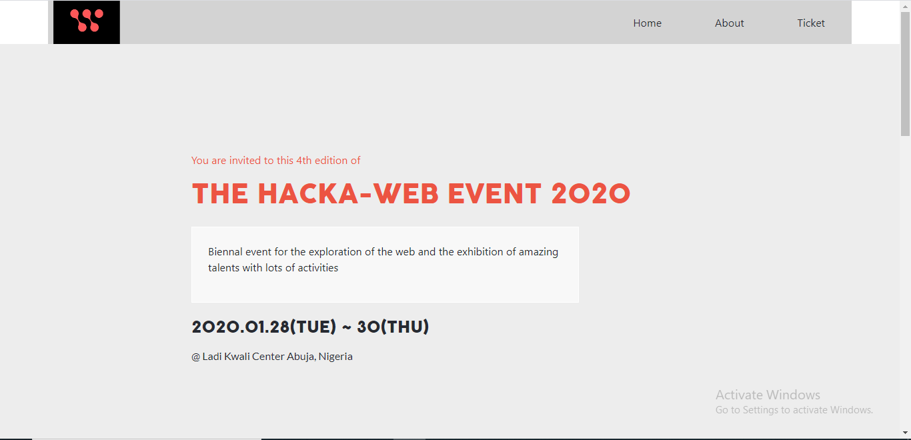

# Hacka-Web Event

> This is a Capstone project that follows the given design as can be found in [here](https://www.behance.net/gallery/29845175/CC-Global-Summit-2015)
> This project follows the above design but with personalized content

## Built With

- CSS3
- HTML
- Bootstrap

## Live Demo

[Visit the Demo](https://tedlivist.github.io/html-capstone/)

## Getting Started

### To get a local copy up and running simply follow the next step.

Clone this repository on to your local PC
- Click on the `Code` green button
- By the right end of the read-only input containing the repository link click the clipboard icon to copy the link
- In your local PC, open your terminal in the folder you would like to clone the repository into
- Clone the repository with the command: `git clone (copied link)`; like so: `git clone https://github.com/TedLivist/html-capstone.git`

## Author

👤 **Teddy-Livingstone Ememandu**

- [GitHub](https://github.com/TedLivist)
- [Twitter](https://twitter.com/iamxted)
- [LinkedIn](https://linkedin.com/in/tememandu)

## 🤝 Contributing

Contributions, issues, and feature requests are welcome!

Feel free to check the [issues page](../../issues/).

## Show your support

Give a ⭐️ if you like this project!

## Acknowledgments

- A special thanks to [Cindy Shin](https://www.behance.net/adagio07) whose design template was used
- Microverse