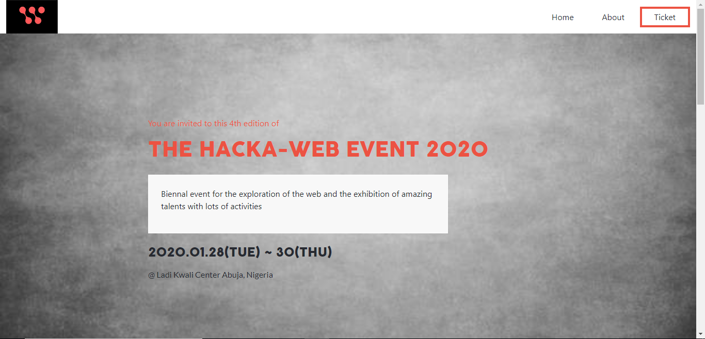

# Hacka-Web Event

> This is a website covering basic details regarding the Hacka-Web Event 2020!

## Built With

- CSS3
- HTML
- Bootstrap

## Live Demo

[Visit the Demo](https://tedlivist.github.io/library-capstone/)

## Getting Started

### To get a local copy up and running simply follow the next step.

- Clone this repository on to your local PC

## Author

👤 **Teddy-Livingstone Ememandu**

- [GitHub](https://github.com/TedLivist)
- [Twitter](https://twitter.com/iamxted)
- [LinkedIn](https://linkedin.com/in/tememandu)

## 🤝 Contributing

Contributions, issues, and feature requests are welcome!

Feel free to check the [issues page](../../issues/).

## Show your support

Give a ⭐️ if you like this project!

## Acknowledgments

- A special thanks to [Cindy Shin](https://www.behance.net/adagio07) whose design template was used
- Microverse